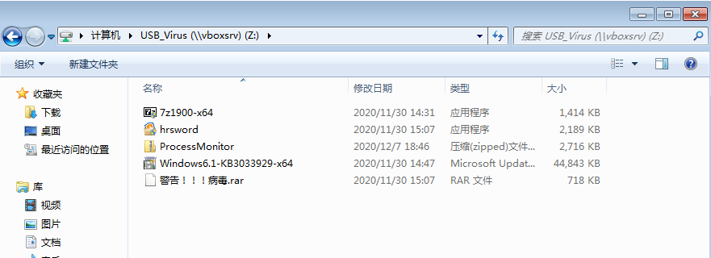

# 第四次作业——龙双杰——2020212063044
* [1.准备工作](#1)

   * [1.1ProcessMonitor遇到的的问题](#1.1)
   * [1.2安装其他必要软件](#1.2)
* [2.感染病毒](#2)

   * [2.1解压缩后以管理员权限运行](#2.1)
   * [2.2简单查看中毒后的变化](#2.2)
* [3.病毒行为分析](#3)

   * [3.1使用ProcessMonitor的Filter功能](#3.1)
   * [3.2导出为CSV文件](#3.2)
   * [3.3在Excel里观察病毒行为](#3.3)
* [4.查杀病毒](#4)

   * [4.1使用火绒剑结束进程树](#4.1)
   * [4.2删除残存在电脑里的exe病毒文件与autorun文件](#4.2)
   * [4.3删除开机启动项](#4.3)
* [5.恢复原貌](#5)

   * [5.1重启后检查病毒是否清除干净](#5.1)
   * [5.2恢复被篡改的注册表](#5.2)
   * [5.3确认工作](#5.3)

<h2 id="1">1.准备工作</h2>

<table>
   <tr>
      <td>首先将本次实验所需的7zip、火绒剑、ProcessMonitor安装包及病毒压缩包通过虚拟机内只读共享文件夹的形式拷入虚拟机当中。</td>
<td align="center"></td>
</table>

<h3 id="1.1">1.1ProcessMonitor遇到的的问题</h3>

由于本次实验下载的ISO镜像文件是从网络第三方下载，在运行ProcessMonitor时碰上了如下问题：

通过使用搜索引擎得知，是该版本的Windows不支持SHA-2类型的证书签名请求，因此下载安装了更新包后，问题得以解决。

<h3 id="1.2">1.2安装其他必要软件</h3>

将其他软件安装好后，万事俱备只欠东风。

<h2 id="2">2.感染病毒</h2>
<h3 id="2.1">2.1解压缩后以管理员权限运行</h3>

<h3 id="2.2">简单查看中毒后的变化</h3>

发现任务管理器与组织里的文件夹与搜索选项不可使用，而cmd里的tasklist仍然可以使用，并且C盘系统文件被隐藏。

<h2 id="3">3.病毒行为分析</h2>
<h3 id="3.1">3.1使用ProcessMonitor的Filter功能</h3>

<h3 id="3.2">3.2导出为CSV文件</h3>

这里我们先直接打开病毒，保存一次进程记录文件；再用管理员权限打开，记录一次，得到两个CSV文件。

<h3 id="3.3">3.3在Excel里观察病毒行为</h3>

将两表合并，并筛选调部份重复项后，发现病毒在获得管理员权限后，篡改了注册表，特别是开机启动项与任务管理器的权限。因此我们杀毒的重点应该在删除注册表里的可疑文件。

<h2 id="4">4.查杀病毒</h2>
<h3 id="4.1">4.1使用火绒剑结束进程树</h3>

<h3 id="4.2">4.2删除残存在电脑里的exe病毒文件与autorun文件</h3>

<h3 id="4.3">4.3删除开机启动项</h3>

在结束掉进程树,且删除掉残存的病毒文件后，我们便可将注册表里涉及病毒的文件删除。

但发现有几个启动项文件删除不了，但这无伤大雅，因我们将其涉及的.exe文件已经全部删除。

<h2 id="5">5.恢复原貌</h2>
<h3 id="5.1">5.1重启后检查病毒是否清除干净</h3>
重启后打开火绒剑或用cmd执行tasklist命令，发现病毒程序已经不再进程当中,但文件搜索与任务管理器仍然无法使用，这是由于未将被篡改的注册表恢复的结果。

<h3 id="5.2">5.2恢复被篡改的注册表</h3>
找到注册表中的HKEY_CURRENT_USER\Software\Microsoft\Windows\CurrentVersion\Policies\
恢复文件夹与搜索选项：修改Explorer下的NoFolderOptions的“字串符值”或者“DWORD值”改为0即可。
恢复任务管理器：修改System下的 DisableTaskMgr 的“字串符值”或者“DWORD值”改为0即可。

<h3 id="5.3">5.3确认工作</h3>
检查任务管理器与文件夹与搜索选项是否恢复:

两者都已恢复。

再将C盘中被隐藏的文件恢复：
将文件夹选项中，选择显示隐藏文件一项并应用。

刷新后看到回归的C盘系统文件夹。

# 作业结束

